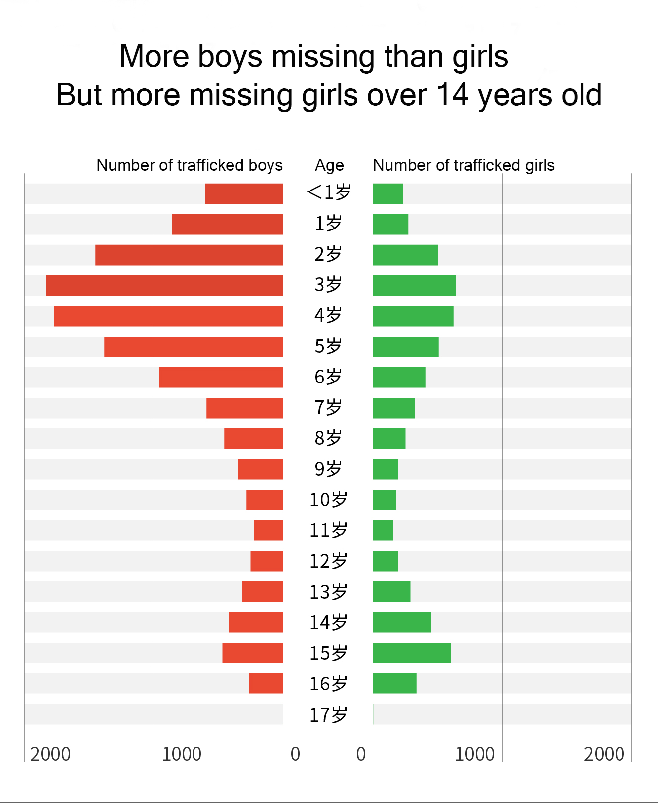

# Most child traffickers sentenced to less than 10 years in China
Link to the orginal story: https://datanews.caixin.com/2020-06-11/101565757.html (in Chinese and paywalled)

By Mengyuan Dong

During the Two Sessions of the National People’s Congress (NPC) in 2020, Zhang Boyan, an NPC deputy, initiated a proposal to increase the sentences for human traffickers and investigate their liabilities for life, sparking a public debate on the issue of trafficking women and children.

According to the National Bureau of Statistics, there were 5,397 criminal cases of trafficking
women and children filed by China’s public security bureaus in 2018, which was the lowest in five years. However, it still means that about 15 women or children are abducted and sold every day, not to mention many more cases that are not being reported.

Since the establishment of the crime of human trafficking in the Criminal Law of the People’s Republic of China in 1979, the law on human trafficking has continued to evolve. Four years after, the circumstances that can lead to heavy sentences were refined. In 1991, buying trafficked women and children became a crime. 

In different kinds of human trafficking, child abduction has been the most severe and widely discussed in China. From time to time, there have been calls for longer prison sentences for traffickers, even up to the death penalty, considering the tremendous trauma that trafficking brings to children and their families.

According to Article 240 of the Criminal Law, human traffickers shall be sentenced to imprisonment for a term of not less than five years but not more than ten years. Those with severe circumstances may be sentenced to a term of not less than ten years or life imprisonment, and those with dire circumstances may receive the death penalty.

Caixin went through 380 verdicts of local people’s courts at all levels regarding child trafficking throughout 2019 and found that more than half of child traffickers were sentenced to only three years or less in prison. For the buyers of trafficked children, 97 percent were sentenced to fixed-term imprisonment of one year or less, or criminal detention, control, or exemption from criminal punishment.

Defendants who have pleaded guilty or are older are likely to receive a lighter sentence or be declared on probation. In mega child trafficking cases, the main offender may be sentenced to life imprisonment or death. For instance, in a cross-provincial child trafficking case sentenced on May 31, 2019, 12 traffickers transferred a large number of toddlers from Shanxi to Shandong. The two main perpetrators were sentenced to death, and the rest were sentenced to life imprisonment and prison terms ranging from six months to 15 years.

Child trafficking and the problem of missing children always go hand in hand. Zhang Baoyan, the NPC deputy who proposed “increasing the sentences for traffickers,” is also the founder of the child-finding website “Baby Back Home.” There are no public statistics on the number of missing children in China each year. But as the largest website for registering information on lost children in China, combing through the posts on the “Baby Back Home” may help reveal the current situation of missing children in China.

Caixin scraped and analyzed 18,667 posts of missing children reported from 1978 to 2020 on the site and found a striking pattern of younger children and more boys. However, when it comes to the age range of 14- to 17-year-old, the number of missing girls is more than boys.

In terms of time, the late 1980s and 1990s saw most cases of missing children. On the “Baby Back Home” website, there were more than 700 registrations per year from 1989 to 1999. After the 21st century, the number of registered missing children began to steadily decline.

In terms of regions, the central and southwestern regions had the highest number of reported missing children, led by Guizhou, Sichuan and Henan, followed by Guangdong, Chongqing, Hubei and Shaanxi.

The eastern and southwestern regions had higher number of trafficking cases, with Shandong, Fujian, Henan, Hebei and Yunnan and Sichuan on the top of the list. According to a research paper on the Geographical Characteristics of Child Trafficking Crimes in China published in 2017, scholars described the spatial pattern of child trafficking as “concentrated trafficking in the west and scattered selling in the east.”

On May 15, 2016, the Ministry of Public Security officially launched the "Reunion" system, which has become a primary platform for collecting and spreading information on missing children. Since its launch four years ago, the platform has reported 4,500 missing children cases. The cases on "Reunion" system show that "running away from home" has become the biggest reason for children to go missing. 

With the ongoing anti-trafficking activities, how to reduce the number of minors running away from home deserves more attention from the public. According to a 2018 report by Missing Children Europe, the European organization that cares for lost children, conflicts in family and at school are the most common reasons for children to run away from home.

The most common conflicts in family include domestic violence, neglect from parents and parental divorce, while the most experienced hardships in school are academic pressure and bullying.

